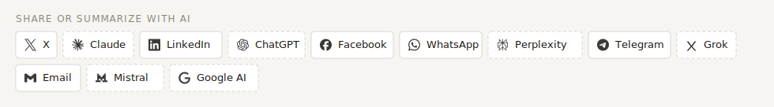

# astro-social-ai-component

A compact **share + “summarize with AI”** bar for Astro. One row of buttons that deep-link the
current post to social networks **and** to AI assistants with a ready-made “summarize this article”
prompt. Self-contained, themable and dependency-free — drop it into any Astro project, above and/or
below your article content.

Built originally for [carrero.es](https://carrero.es); extracted to be reusable.



## What it does

- **Share** to: X (Twitter), LinkedIn, Facebook, WhatsApp, Telegram, Email.
- **Summarize with AI** in: ChatGPT, Claude, Perplexity, Grok, Mistral, Google AI — each opens the
  assistant pre-filled with a prompt that asks for a structured summary and **cites your URL as the
  source**. (Assistants whose web chat doesn't prefill from a URL — e.g. Gemini, DeepSeek,
  Copilot — are intentionally left out; see CHANGELOG.)
- Everything is **dynamic per page** (title + canonical URL). Pick which platforms appear and in
  what order. Compact by design (icon + short label, ~2 lines; icon-only on phones).

## Install

Until it's published to npm, copy `src/ShareBar.astro` and `src/platforms.ts` into your project
(e.g. `src/components/`). Or add it as a local/git dependency and import from the package.

## Usage

```astro
---
import ShareBar from 'astro-social-ai-component/ShareBar.astro';
// or: import ShareBar from '../components/ShareBar.astro';

const title = entry.data.title;
const url = new URL(`/blog/${entry.data.slug}/`, Astro.site).href; // canonical absolute URL
---
<!-- below the title -->
<ShareBar title={title} url={url} handle="@you" />

<article set:html={html} />

<!-- and/or after the content -->
<ShareBar title={title} url={url} handle="@you" />
```

## Props

| Prop | Type | Default | Notes |
|------|------|---------|-------|
| `title` | `string` | — | Article title, used in share text. **Required.** |
| `url` | `string` | — | Canonical **absolute** URL of the page. **Required.** |
| `handle` | `string` | — | Appended to the X/Twitter text (e.g. `@you`). |
| `platforms` | `string[]` | all | Keys/order to render. See `platforms.ts` (`SHARE_DEFAULT`). |
| `labels` | `boolean` | `true` | `false` = icon-only (most compact). |
| `heading` | `string \| null` | `'Comparte o resume con IA'` | Small label; `null` to hide. |
| `class` | `string` | — | Extra class on the wrapper. |

Choose a subset:

```astro
<ShareBar title={title} url={url} platforms={["twitter", "linkedin", "whatsapp", "chatgpt", "claude", "perplexity"]} />
```

## Theming

Styles are scoped and driven by CSS variables with fallbacks. It inherits a host theme that defines
`--ink`, `--muted`, `--accent`, `--border-strong`, `--surface`, `--accent-soft`, `--font-mono`;
otherwise it uses neutral defaults. Override per instance or globally:

```css
.share-bar {
  --sb-accent: #2563eb;
  --sb-border: #e5e7eb;
  --sb-bg: #fff;
}
```

AI buttons use a dashed border (`.share-bar__btn.is-ai`) to set them apart from social ones.

## Customize the AI prompt / add platforms

Edit `src/platforms.ts`: each platform is `{ key, label, kind: 'social' | 'ai', icon, href(ctx) }`.
The AI prompt is built in `aiPrompt(url)` — change the wording or language there. Add a new
assistant by appending an entry and its key to `SHARE_DEFAULT`.

## License

MIT © David Carrero Fernández-Baillo
